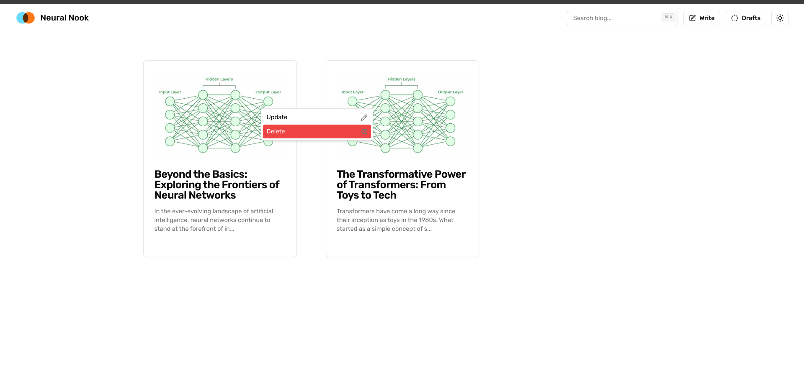

## Next.js Personal Blog
This is an Next.js personal blog website utilizing the latest `app` folder for routing, with `dynamic routing` for Firebase `Firestore` as its database and `Firebase Storage` for storing images. The site also leverages `Shadcn` as its component library and Next.js API routes for server-side logic.

## Features
- Notion-style WYSIWYG editor
- Editor includes slash commands
- Drafting Blogs
- Search Functionality
- Dark Mode

## Getting Started

> Important you need to add `OPENAI_API_KEY` in .env to take advantage of ai features while writing an article

First, run the development server:

```bash
npm run dev
# or
yarn dev
# or
pnpm dev
# or
bun dev
```

Open [http://localhost:3000](http://localhost:3000) with your browser to see the result.


## How to Update and Delete Blogs 

You can right click on any blog on the homepage to update & delete blog.

